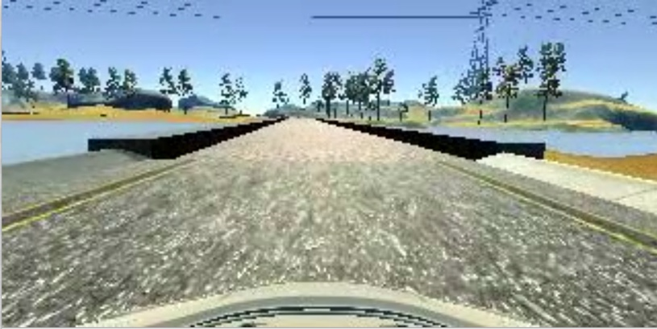

# **Behavioral Cloning**

## Writeup by Matthew Jones

### Project: CarND-Behavioral-Cloning_P4

---

**Behavioral Cloning Project**

The major steps followed to complete this project included:
* Using the simulator to collect data of good driving behavior
* Building a convolution neural network in Keras that predicts steering angles from images
* Training and validating the model with a training and validation set
* Testing that the model successfully drives for at least one lap around the track without leaving the road
* Summarising the results in a written report


[//]: # (Image References)

__Video output from Autonomous driving recording__  
[download video](https://github.com/matttpj/CarND-Behavioral-Cloning/blob/master/run2.mp4)

<br/>


## Rubric Points
### Here I will consider the [rubric points](https://review.udacity.com/#!/rubrics/432/view) individually and describe how I addressed each point in my implementation.  

---
### Writeup / README
Here is a link to my [project code](https://github.com/matttpj/CarND-Behavioral-Cloning)  

---
### Files Submitted & Code Quality

#### 1. Submission includes all required files to run the simulator in autonomous mode and save the output

Key files are:
 * Creates and saves the model: _model.py_   
 * Model output: _models/model_nVidia.h5_
 * Runs the model in the simulator and drives the car in Autonomous mode: _drive.py_     
 * Video output of the car driving round the track: _runX.mp4_      
 * Writeup that summarises results: _writeup_CarND-Behavioral_Cloning_P4.md_


#### 2. Submission includes functional code
Using the Udacity provided simulator and my _drive.py_ file, the car can be driven autonomously around the track by executing
```python drive.py models/model_nVidia.h5 run2
```

#### 3. Submission code is usable and readable

The _model.py_ file contains the code for training and saving the convolution neural network; first using a LeNet configuration and second using a nVidia configuration, as recommended by the Udacity program. The nVidia model proved itself to perform well very quickly; eg. enabling the car to complete a lap of the track without leaving the track. The file shows the pipeline I used for training and validating the models and it contains comments to explain how the code works.

### Model Architecture and Training Strategy

#### 1. An appropriate model architecture has been employed

My nVidia derived model consists of a convolution neural network with 3x3 filter sizes and depths between 32 and 128 (model.py lines 18-24)

The model includes RELU layers to introduce nonlinearity (code line 20), and the data is normalized in the model using a Keras lambda layer (code line 18).

#### 2. Attempts to reduce overfitting in the model

The model contains dropout layers in order to reduce overfitting (model.py lines 21).

The model was trained and validated on different data sets to ensure that the model was not overfitting (code line 10-16). The model was tested by running it through the simulator and ensuring that the vehicle could stay on the track.

#### 3. Model parameter tuning

The model used an adam optimizer, so the learning rate was not tuned manually (model.py line 25).

#### 4. Appropriate training data

The Udacity provided initial set of Training data _IMG/*.jpg_ and _driving_log.csv_ was used very successfully.  No additional training data seemed to be required.

### Model Architecture and Training Strategy

#### 1. Solution Design Approach

My overall strategy for deriving a model architecture was to start with a LeNet architecture and then try alternatives, including the referenced nVidia approach.
https://developer.nvidia.com/blog/deep-learning-self-driving-cars/

I first setup my _model.py_ file as described by David Silver in the program videos; but I even struggled to load the Training data images and skip the header row in the _driving_log.csv_.  And then I found DarienMT solution which I used as guide to fix this and other challenging issues; eg. loading center, left and right camera images and data from the driving log.   
https://github.com/darienmt/CarND-Behavioral-Cloning-P3

In order to gauge how well the model was working, Keras allowed me to easily split my image and steering angle data into a training and validation set.

At the end of the process, the vehicle is able to drive autonomously around the track without leaving the road.

#### 2. Final Model Architecture

The final model architecture (model.py lines 18-24) consisted of a convolution neural network with the following layers and dimensions.

## Image data pre-processing
| Step      		|     Description	        					|
|:---------------------:|:---------------------------------------------:|
| Sequential       		|  Groups a linear stack of layers into a model that Keras can use  							|
| Lambda   	| Normalise images to mean = 0; set images input shape to height/width/channels (160,320,3)	|
| Cropping2D  				|	Crop individual images by top/bottom (50,20) and left/right (0,0)											|

## Model parameters derived from nVidia example

| Layer         		|     Parameter Description	        					|
|:---------------------:|:---------------------------------------------:|
| Input         		| 90x320 BGR image   							|
| Layer 1: Convolution 2D    	| 24 filters, 5x5 kernel, 2x2 stride 	|
| RELU					|												|									|
| Layer 2: Convolution 2D     	| 36 filters, 5x5 kernel, 2x2 stride	|
| RELU					|												|
| Layer 3: Convolution 2D     	| 48 filters, 5x5 kernel, 2x2 stride 	|
| RELU					|												|
| Layer 4: Convolution 2D     	| 64 filters, 3x3 kernel	|
| RELU					|												|
| Layer 5: Convolution 2D     	| 64 filters, 3x3 kernel 	|
| RELU					|												|
|	Flatten					|												|
|	Dense		|	100	output dimensions									|
|	Dense					|	50 output dimensions											|
|	Dense					|	10 output	dimensions										|
|	Dense					|	1	 Output	dimensions								|
|						|												|

## Model training
| Step      		|     Parameter Description        					|
|:---------------------:|:---------------------------------------------:|
| model.compile()      		|  loss = 'mse'				| mean square loss to minimise errors |
|  | optimizer = 'adam'  | more efficient algorithim for calculating gradient descent |
| model.fit()   	|  validation_split = 0.2	| to split off 20% of image data to be used for testing at end of each epoch |
|  | shuffle = True | shuffle the images before saving the model |
|  | epochs = 5 | recommended by Paul Heraty |

#### 3. Creation of the Training Set & Training Process

I used the Udacity provided images from recording of the vehicle successfully driving 1 lap of the track, with dimensions 320x160 (width x height).

Starting with the Center image, and then subsequently working with the Left and Right images and a correction factor (0.2), that would enable the model to help the vehicle re-find the center of the track.

As suggest by the Udacity program, I also augmented the dataset by flipping all the test images to improve the model so that it did not suffer from bias of getting trained only by images from a vehicle that was driving clockwise around the track.

| Left     		|     Center        					|    Right    |
|:---------------------:|:----------------------------:|:-----------------:|
|      		|  			|  |
